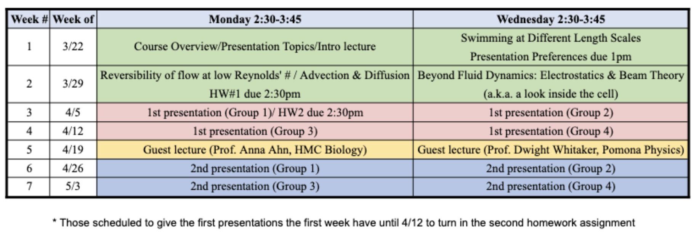

# Physics 174: Biophysics

Jessica Arlett: jarlett@hmc.edu
[Classroom discussion board](https://join.slack.com/t/g-v0c9269/shared_invite/zt-k4lw8ayu-QAuqdJdQMstuSJ9CYWGRpA)

## Course Description

Biophysics involves the use of techniques from physics to study and describe living systems. Ideas are borrowed from equilibrium & non-equilibrium statistical mechanics, polymer physics, classical & continuum mechanics, and electrodynamics to probe and describe admittedly complex biological systems. In this course, we will explore how diffusion, flow, and swimming behavior impact biolocomotion as well as biomolecular signaling and detection. We will examine how the size of an organism and its interaction with the environment can have significant consequences for movement. This course will be taught in a seminar format. Students will learn to approach a new research field and develop a coherent understanding based on review articles and original research articles.

## Course Goals

After this course you will be able to:
+ Describe how classical and statistical mechanics have been successfully applied to
biolocomotion
+ Approach a new research field and develop a coherent understanding based on review articles
and original research articles
+ Give a presentation on a primary research article
+ Provide constructive feedback on presentations

## Workload

In this course your workload will consist of:
+ one assignment related to swimming, flow, and diffusion
+ reading your classmates’ journal articles (~ 4-6/week) and keeping an active reading journal
+ preparing two 20 minute presentations on topics you select (spaced out over the semester)
+ provide feedback to your classmates on their presentations
+ participate in class discussion and ask questions during your classmates’ presentations

## Grading

Grading
Your final grade will be evaluated based on a weighted average of the following
+ 10% for homework #1
+ 30% presentation #1
+ 30% presentation #2
+ 15% active reading journal
+ 15% in-class participation

## Journal Articles
Journal articles are available [here](https://jlarlett.github.io/Ph174/library). A link to the repository of articles is also provided on the course Sakai site. Please note that some journals require you to log in through VPN to access campus journal subscriptions. Step-by-step instructions for connecting to HMC VPN are available [here](https://www.hmc.edu/cis/services/vpn/).

## Accommodations

Harvey Mudd College strives to make all learning experiences as accessible as possible. If you anticipate or experience academic barriers based on your disability (including mental health, chronic or temporary medical conditions), please let me know immediately so that we can privately discuss options. You also need to register with the Office of Disability Resources to establish reasonable accommodations. After registration, make arrangements with me as soon as possible to discuss your accommodations so that they may be implemented in a timely fashion. Contact Brandon Ice, Student Accommodation Advisor, via email bice@hmc.edu or phone 909.607.3148 with any questions. Students from the other Claremont Colleges should contact their home college's disability officer.

## Wellness

Please let me know in advance of a missed class if possible, or as soon as you can after the fact. I also know that a variety of events in life can take priority over individual class meetings. If an event in your life, public or private,is creating conflicts with class, please feel free to discuss it with me.

## Belonging

BelongingEveryone who is registered for this course belongs here and has valuable contributions to make to our class. Our diversity of backgrounds, experiences, and viewpoints will enrich theclassroom, and our mutual respect will grant us all the grace to make mistakes and learn from them.
