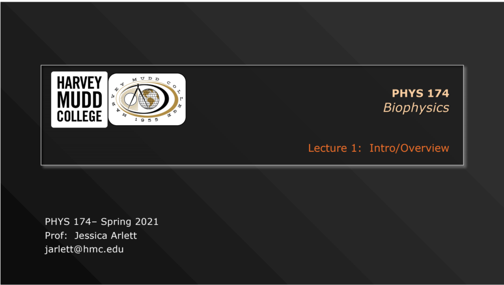
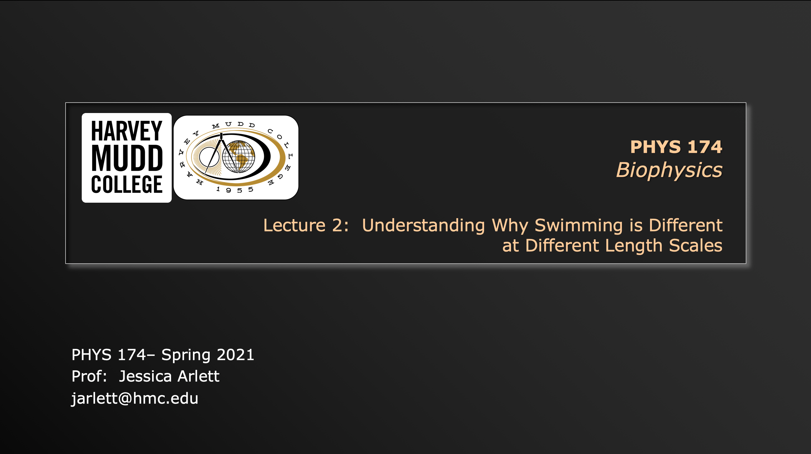
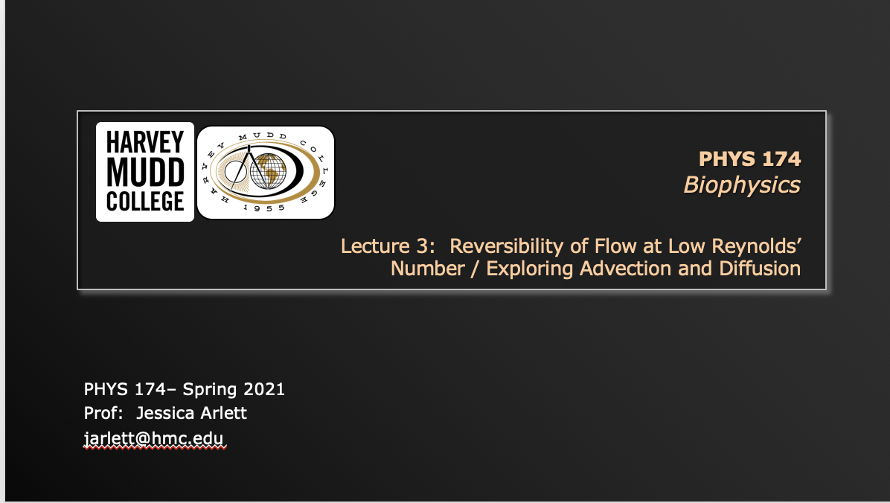
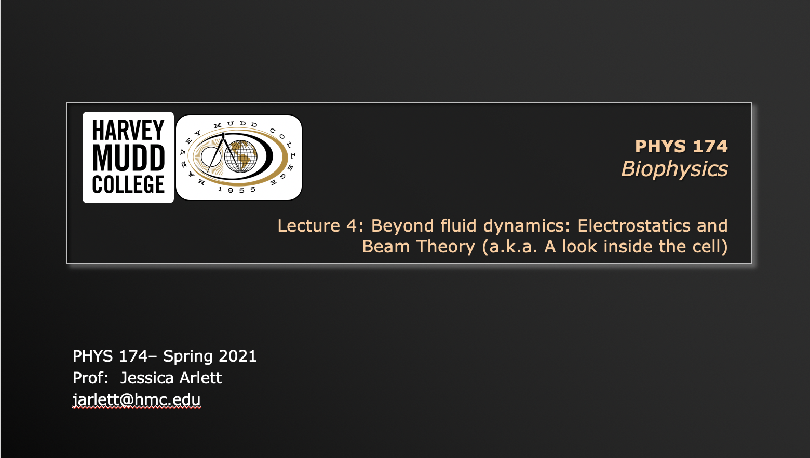

Lecture #1: Monday, March 22, 2021 - Introduction and Overview of Presentation Topics

Video of lecture (click on the image to open):

{:target="_blank"} 

[Click here to download Lecture 1 slides](https://drive.google.com/file/d/1j4kWxab2vvs-LTymFc3YzUSofVjUYalJ/view?usp=sharing){:target="_blank"}

Lecture #2: Wednesday, March 23, 2021 - Understanding why swimming is different at different length scales

{:target="_blank"} 

[Click here to download Lecture 2 notes](https://drive.google.com/file/d/1a_M20OadAcegLKflYTUKGvh3W2zSAZx0/view?usp=sharing){:target="_blank"}

[Click here to download Lecture 2 slides](https://drive.google.com/file/d/1LB1WSayiKOVfLZkkN6H-NCOQifIxu5A_/view?usp=sharing){:target="_blank"}

Lecture #3: Monday, March 29, 2021 - Reversibility of Flow at Low Reynolds’ Number / Exploring Advection and Diffusion

{:target="_blank"} 

[Click here to download Lecture 3 slides](https://drive.google.com/file/d/1SM7K3BPCaTXpSOq2ImkY0mJ5cRH1XPwQ/view?usp=sharing){:target="_blank"}

[Click here to download Lecture 3 notes](https://drive.google.com/file/d/13cMLfxy6VptjxvsGPH7yFTlJml2LTZfV/view?usp=sharing){:target="_blank"}

Lecture #4: Wednesday, March 31, 2021 - Lecture 4: Beyond fluid dynamics: Electrostatics and Beam Theory (a.k.a. A look inside the cell)

I apologize - the recording is missing the first 2 slides as I was late to turn on the recording. Hopefully those slides are fairly self explanatory and can be seen in the slide deck. Also for this recording you will need the following passcode: 38P0XVU#  
{:target="_blank"} 

[Click here to download Lecture 4 slides](https://drive.google.com/file/d/1PPfIS1SEwyKXIHp5ahq83CpREfXOKong/view?usp=sharing){:target="_blank"}

